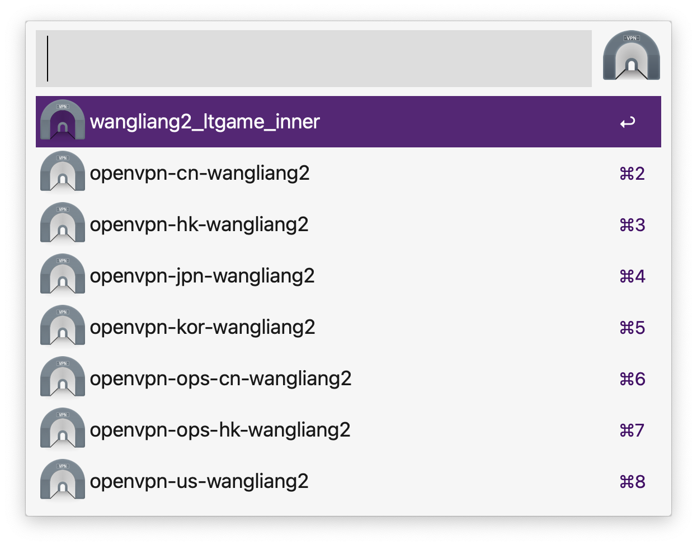

## @liangshen/alfred-tunnelblick

*Alfred工作流，使用Tunnelblick软件快速连接VPN*

*Alfred workflow for Tunnelblick*

### 运行环境

* Nodejs 14.x.x
* Alfred Powerpack
* Tunnelblick

### 安装

```
npm install @liangshen/alfred-tunnelblick -g
```

### 使用方法

可使用 option + T 快捷键调出本工作流搜索框(或者调出alfred搜索框输入关键字 tunnelblick)




可以输入关键字进行搜索，回车选中配置可以连接VPN


再次查询配置可以看到正在连接的VPN 回车连接的VPN可以执行断开连接


